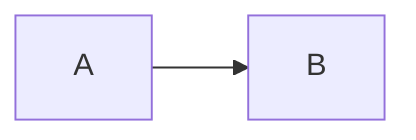

# Tech Blog

Markdownで記事を書き、GitHub Actionsで静的HTMLに変換してGitHub Pagesで公開する技術ブログ。

## 構成

```
Markdown → git push → GitHub Actions → Pandoc → HTML → GitHub Pages
```

- フレームワーク不使用（Hugo, Next.js, Astro等なし）
- テーマ不使用
- CMS不使用
- 外部Pythonライブラリ不使用

## 技術スタック

| 用途 | ツール |
|------|--------|
| 記事管理 | Markdown (YAML front matter) |
| HTML変換 | Pandoc |
| ビルドスクリプト | Python (標準ライブラリのみ) |
| CI/CD | GitHub Actions |
| ホスティング | GitHub Pages |
| 画像配信 | S3 + CloudFront |
| コードハイライト | Prism.js (CDN) |
| 図 | Mermaid (CDN) |
| 検索 | Fuse.js (クライアントサイド, JSONインデックス) |

## ディレクトリ構成

```
blog/
├── posts/                  # 記事 (Markdown)
│   └── hello-world/
│       └── index.md
├── templates/
│   ├── post.html           # Pandocテンプレート
│   └── style.css           # スタイルシート
├── scripts/
│   └── build.py            # ビルドスクリプト
├── public/                 # 生成物 (.gitignore)
├── .github/
│   └── workflows/
│       └── build.yml       # CI/CDワークフロー
├── Dockerfile
└── Makefile
```

## 記事の書き方

### 1. 記事ディレクトリを作成

```bash
mkdir -p posts/my-article
```

### 2. Markdownを書く

`posts/my-article/index.md`:

```markdown
---
title: 記事タイトル
date: 2026-03-15
tags: [security, web]
---

本文をここに書く。

## コードブロック

```python
print("Hello")
```

## Mermaid図


```

### front matter

| フィールド | 必須 | 説明 |
|-----------|------|------|
| `title` | ○ | 記事タイトル |
| `date` | ○ | 公開日 (YYYY-MM-DD) |
| `updated` | | 更新日 (YYYY-MM-DD) |
| `tags` | | タグ一覧 `[tag1, tag2]` |

### 3. 公開

```bash
git add posts/my-article/
git commit -m "Add article: my-article"
git push
```

GitHub Actionsが自動でHTMLを生成し、GitHub Pagesに公開します。

## URL構造

```
/                           トップページ
/posts/                     記事一覧
/posts/<slug>/              個別記事
/tags/                      タグ一覧
/tags/<tag>/                タグ別記事一覧
/search/                    検索ページ
/rss.xml                    RSSフィード
```

## ローカル開発

Docker を使ってビルド・プレビューできます。

```bash
# ビルド（HTML生成）
make build

# ローカルプレビュー（http://localhost:8000）
make serve

# 生成物の削除
make clean
```

生成されたHTMLは `public/` に出力されます。
