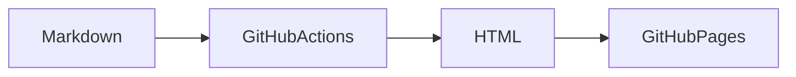

This is a sample post to verify the blog build pipeline.

## Code Block

```python
def greet(name: str) -> str:
    return f"Hello, {name}!"

print(greet("world"))
```

## Mermaid Diagram



## Inline Code

Use `git push` to deploy.

## List

- Markdown articles
- Static HTML generation
- GitHub Pages hosting

