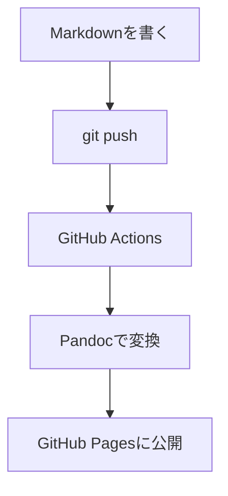

技術ブログを書く際に便利なMarkdownの機能をまとめます。

## 見出し

`#` の数で見出しレベルを指定します。記事タイトルは自動生成されるため、本文では `##` から使います。

## コードブロック

言語を指定するとシンタックスハイライトが適用されます。

```javascript
const greeting = (name) => `Hello, ${name}!`;
console.log(greeting("world"));
```

シェルコマンドも記述できます。

```bash
git add posts/my-article/index.md
git commit -m "Add new article"
git push origin main
```

## インラインコード

文中では `backtick` で囲むとインラインコードになります。例: `docker compose up` で起動します。

## リンクと画像

- リンク: `[テキスト](URL)`
- 画像: ``

画像はS3にアップロードし、フルURLで参照します。

## テーブル

| コマンド | 説明 |
|---------|------|
| `make build` | ブログをビルド |
| `make serve` | ローカルプレビュー |
| `make clean` | ビルド出力を削除 |

## 引用

> Markdownはシンプルで読みやすい記法です。
> HTMLに変換しても、そのまま読んでも理解できます。

## ダイアグラム

Mermaidを使ってフローチャートを描けます。



## チェックリスト

記事を書く際の確認事項:

- front matterに `title` と `date` を記載
- コードブロックには言語を指定
- 画像はフルURLで参照
- slugは英語のkebab-case
