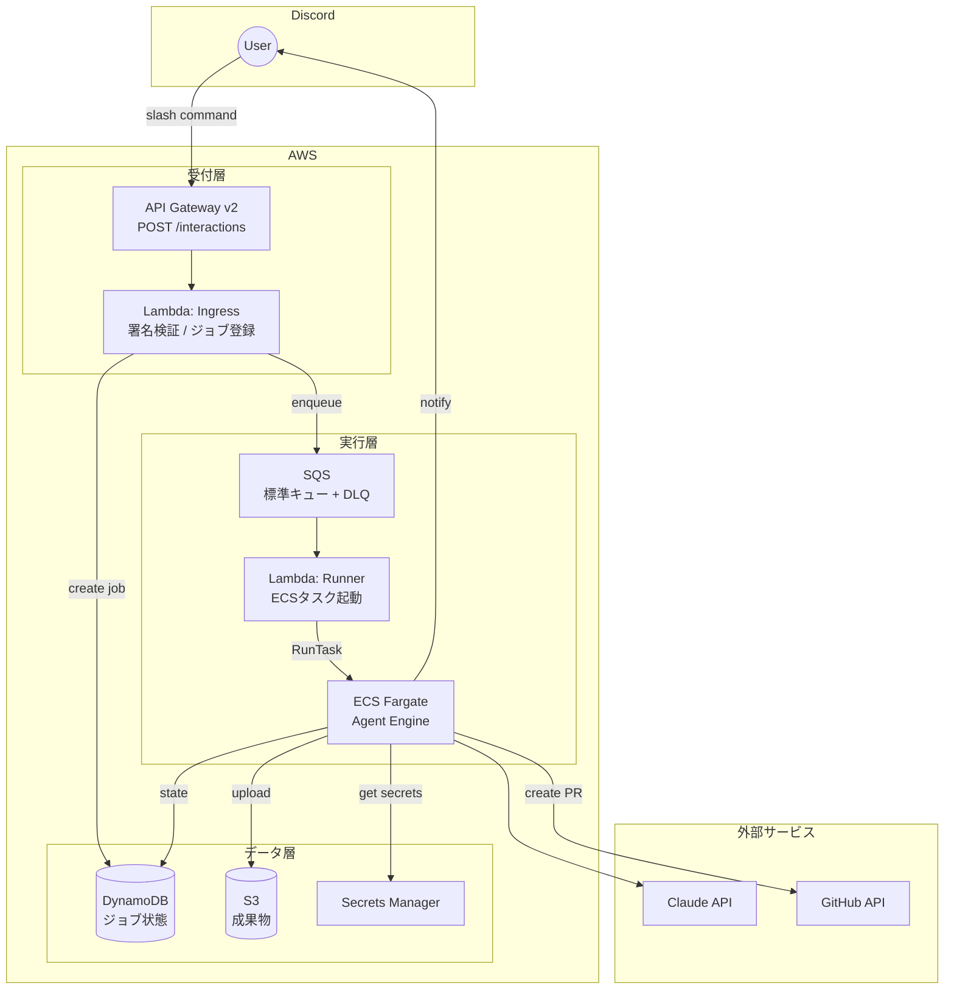
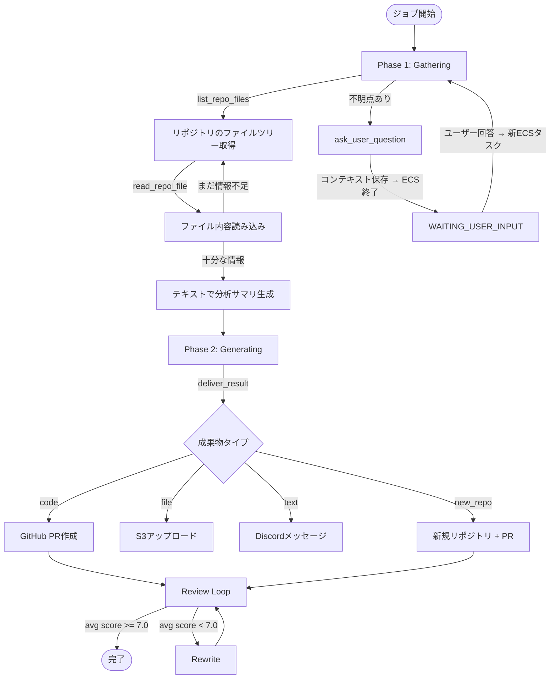
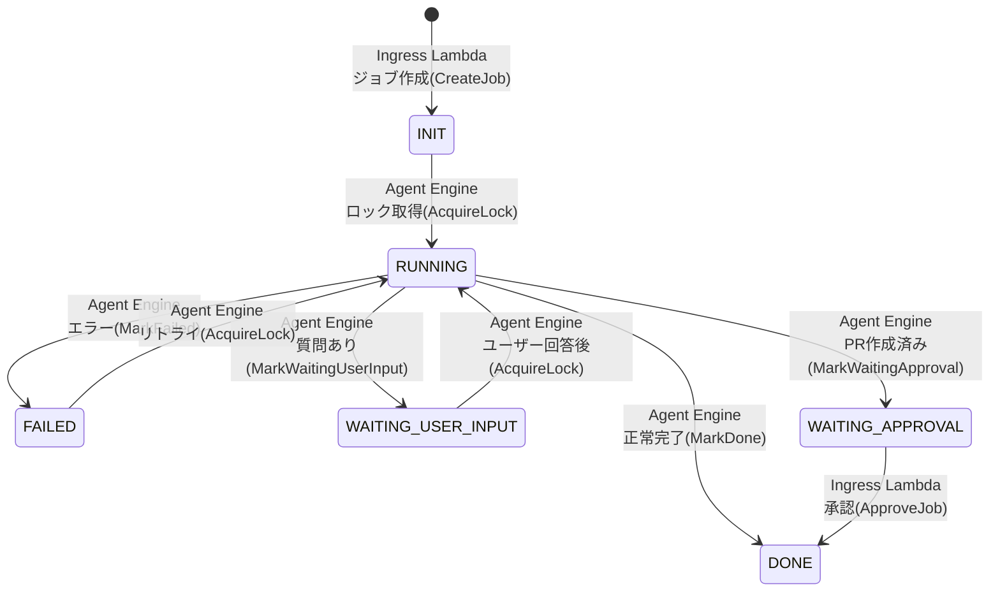
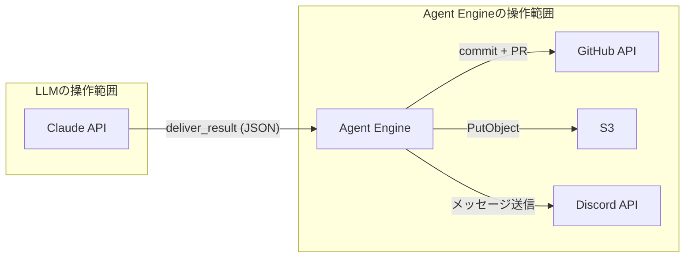

## はじめに

Nemuriは、Discordのスラッシュコマンドで自然言語のタスクを送ると、LLMエージェントがリポジトリを読み込み、コードを生成し、GitHub PRとして返すシステムである。PRに限らず、S3へのファイルアップロードやDiscordへのテキスト返信にも対応している。

開発期間は2週間。OpenClawに関する記事を読んで触発されたのがきっかけで、社会人になって初めての個人開発になった。開発にはClaude Codeを初めて使用した。この記事ではNemuriのアーキテクチャ、実装の詳細、設計判断について書く。

## 技術スタック

| カテゴリ | 技術 |
|---|---|
| 言語 | Go 1.25 |
| LLM | Claude API（claude-sonnet-4-6）直接呼び出し |
| インターフェース | Discord スラッシュコマンド |
| コンピュート | ECS Fargate（エージェント実行）、Lambda（Ingress / Runner） |
| メッセージング | SQS（標準キュー + DLQ） |
| ストレージ | DynamoDB（ジョブ状態）、S3（成果物・会話コンテキスト） |
| API | API Gateway v2（HTTP API） |
| コンテナ | ECR、debian:12-slim ベースイメージ |
| ネットワーク | VPC（パブリックサブネット、NATなし） |
| シークレット | Secrets Manager |
| ログ | CloudWatch Logs |
| IaC | Terraform（モジュール構成、dev/prod環境分離） |
| PDF変換 | goldmark + wkhtmltopdf |
| 主要依存 | aws-sdk-go-v2、aws-lambda-go、google/uuid、yuin/goldmark |

## アーキテクチャ

### 全体構成



設計原則は「常時起動するインフラを持たない」こと。1ジョブ = 1 ECSタスクのワンショット実行で、ジョブがなければAWS費用はほぼゼロになる。長時間起動するサービスは存在しない。

### リクエストフロー

1. ユーザーがDiscordで `/agent <プロンプト>` を実行
2. Discord → API Gateway v2（HTTP API）→ Ingress Lambda が起動
3. Ingress Lambda がEd25519署名を検証し、DynamoDBにジョブレコード（state=INIT）を作成、SQSにエンキュー
4. Discordにはdeferred ACK（type=5）を3秒以内に返す。Discordのインタラクション応答期限が3秒のため、ジョブ処理は非同期で行う必要がある
5. SQSトリガーでRunner Lambdaが起動し、ECS Fargateタスクをキック。コンテナオーバーライドで環境変数 `JOB_ID` を渡す。Runner Lambda成功時にSQSメッセージはイベントソースマッピングにより自動削除される
6. ECSコンテナ上でAgent Engineが起動。ロック取得 → ジョブ実行 → 結果配信

## インフラ構成

### Terraformモジュール構成

Terraformは機能単位でモジュール化し、`envs/{dev,prod}` から呼び出す構成にしている。

```
terraform/
├── envs/
│   ├── dev/main.tf
│   └── prod/main.tf
└── modules/
    ├── network/          # VPC, パブリックサブネット, IGW, セキュリティグループ
    ├── ecr/              # ECRリポジトリ（タグミュータブル、直近5イメージ保持）
    ├── ecs/              # ECSクラスタ, タスク定義, 実行ロール, タスクロール
    ├── sqs/              # 標準キュー（visibility 600秒）+ DLQ（maxReceiveCount: 3）
    ├── lambda_ingress/   # Lambda + API Gateway v2 + POST /interactions ルート
    ├── lambda_runner/    # Lambda + SQSイベントソースマッピング
    ├── dynamodb/         # ジョブテーブル（job_id PK, thread_id GSI, TTL, PAY_PER_REQUEST）
    ├── s3/               # 成果物バケット（AES256暗号化, ライフサイクルルール）
    ├── secrets/          # Secrets Managerリソース
    └── iam/              # 共有IAMポリシー
```

各モジュールの出力（ARN, URL, ID）を次のモジュールの入力に渡しており、Terraformはこの依存関係から network → secrets → dynamodb → sqs → lambda_ingress → s3 → ecr → ecs → lambda_runner の順で作成する。

### ネットワーク設計

VPCにパブリックサブネットを配置し、ECSタスクにパブリックIPを割り当てる。NATゲートウェイは使わない（常時課金を避けるため）。

セキュリティグループはegressをTCP 443（HTTPS）のみに制限している。フォワードプロキシ（Squid等）によるドメイン制限も検討したが、個人開発の規模に対してコストと運用負荷が見合わないため見送った。

### ECSタスク定義

タスク定義では7つの環境変数をコンテナに渡す。シークレットの実値ではなく、Secrets Managerのシークレット名を渡す点がポイントである。

```hcl
resource "aws_ecs_task_definition" "agent" {
  family                   = "${var.project}-${var.environment}-agent-engine"
  requires_compatibilities = ["FARGATE"]
  network_mode             = "awsvpc"
  cpu                      = var.task_cpu
  memory                   = var.task_memory

  container_definitions = jsonencode([{
    name  = "agent-engine"
    image = "${var.ecr_repository_url}:latest"
    environment = [
      { name = "DYNAMODB_TABLE_NAME",            value = var.dynamodb_table_name },
      { name = "AWS_REGION",                     value = var.aws_region },
      { name = "ANTHROPIC_API_KEY_SECRET_NAME",  value = var.anthropic_api_key_secret_name },
      { name = "DISCORD_BOT_TOKEN_SECRET_NAME",  value = var.discord_bot_token_secret_name },
      { name = "GITHUB_PAT_SECRET_NAME",         value = var.github_pat_secret_name },
      { name = "S3_BUCKET_NAME",                 value = var.s3_bucket_name },
      { name = "DEFAULT_GITHUB_OWNER",           value = var.default_github_owner },
    ]
    logConfiguration = {
      logDriver = "awslogs"
      options   = { /* CloudWatch Logs: /ecs/{project}-{env}/agent-engine, 14日保持 */ }
    }
  }])
}
```

Agent Engineの起動時にシークレット系はSecrets Managerから実際のAPIキー/トークンを取得し、それ以外はタスク定義の環境変数から読み込む。タスクロールにはDynamoDB、S3、Secrets Manager、CloudWatch Logsの操作権限を付与している。ECSタスクはSQSとは直接やり取りしない（SQSメッセージの削除はRunner Lambda成功時にイベントソースマッピングが行う）。

### コスト構造

常時稼働するリソースがないため、月額はジョブ実行量に完全に比例する。

- **ECS Fargate**: ジョブ実行時間に比例。CPU/メモリは変数化（デフォルト: 0.25 vCPU / 512 MiB）
- **Lambda**: Ingress（128MB / 10秒タイムアウト）、Runner（128MB / 30秒タイムアウト。RunTask API応答待ちを考慮）
- **DynamoDB**: PAY_PER_REQUEST。TTL（`ttl`属性）で自動削除
- **S3**: ライフサイクルルールでartifacts / outputsを自動削除（日数は変数化）。アウトプットはプリサインドURL（24時間有効）で配信
- **SQS**: 標準キュー + DLQ（14日保持）。メインキュー保持期間は1日

## ソースコード構造

```
nemuri/
├── cmd/
│   ├── agent-engine/        # ECS上で動くメインバイナリ
│   ├── lambda-ingress/      # Discord受付
│   └── lambda-runner/       # SQS → ECS RunTask
├── internal/
│   ├── agent/               # 2フェーズエージェントループ + レビューループ
│   │   ├── agent.go         # Gathering → Generating オーケストレーション
│   │   ├── review.go        # Review → Rewrite サイクル
│   │   └── prompt.go        # システムプロンプト + ツール定義
│   ├── executor/            # ジョブ実行オーケストレータ
│   │   ├── executor.go      # メインディスパッチ + 質問ハンドリング
│   │   ├── code.go          # code/new_repo → GitHub PR
│   │   ├── file.go          # file → S3アップロード
│   │   ├── text.go          # text → Discordメッセージ
│   │   └── resume.go        # 会話コンテキスト復元
│   ├── llm/                 # LLMアダプタ
│   │   ├── llm.go           # Client interface + 型定義
│   │   └── claude.go        # Claude API実装（リトライ, レート制限）
│   ├── state/               # DynamoDB状態管理
│   │   ├── state.go         # ステートマシン + 遷移検証
│   │   └── store.go         # DynamoDB CRUD + ロック
│   ├── converter/           # Markdown → HTML → PDF（goldmark + wkhtmltopdf）
│   ├── discord/             # Discord APIクライアント（v10）
│   ├── github/              # GitHub APIクライアント (interface + 実装)
│   ├── secrets/             # AWS Secrets Managerラッパー
│   └── storage/             # S3操作ラッパー
├── Dockerfile               # マルチステージビルド (3段)
└── go.mod
```

言語はGo。Lambda（`provided.al2023` ランタイム）とECSの両方で単一バイナリにできること、AWS SDK v2が充実していること、最近の業務で使っていることが選定理由。

外部サービスとのやり取りは専用パッケージに分離している。`github.API` や `llm.Client` をインターフェースとして定義し、テスト時にモックに差し替えられるようにしている。Executorのテストではモックを使った単体テストを書いており、LLM呼び出しやGitHub API呼び出しなしでジョブ実行フローを検証できる。`llm.Client` インターフェースは将来的なモデル差し替えにも対応する設計になっている。

### Ingress Lambda の実装

Ingress Lambdaはインタラクションタイプに応じて処理を分岐する。

```go
switch interaction.Type {
case InteractionTypePing:        // 1
    // Discord Webhook検証。PONGを返す
    return respondJSON(http.StatusOK, discordResponse{Type: ResponseTypePong})

case InteractionTypeApplicationCommand:  // 2
    // 通常のコマンド実行 or スレッド内での回答/承認
    return handleApplicationCommand(ctx, interaction)
}
```

`handleApplicationCommand` 内では以下の順序で分岐する。

1. プロンプトを抽出。空なら即座にエラー応答
2. プロンプトが `"approve"` なら `handleApprove` へ — Discordスレッド内では `channel_id` にthread IDが入るため、その値で `thread_id-index` GSIを検索し、WAITING_APPROVAL状態のジョブがあれば `ApproveJob` を呼んでDONEに遷移
3. 同様に `thread_id-index` GSIで検索し、WAITING_USER_INPUT状態のジョブがあれば `handleResume` へ — `SetUserResponse` でユーザー回答を保存し、SQSに再エンキュー
4. どちらでもなければ `handleNewJob` — DynamoDBにジョブレコード作成、SQSにエンキュー

署名検証はEd25519を使う。DiscordのPublic Keyで `timestamp + body` を検証する。

```go
func verifySignature(pubKey ed25519.PublicKey, signature, timestamp, body string) bool {
    sig, err := hex.DecodeString(signature)
    if err != nil {
        return false
    }
    return ed25519.Verify(pubKey, []byte(timestamp+body), sig)
}
```

## Agent Engine: 2フェーズのエージェントループ

Agent Engineの核心は `internal/agent` パッケージにある。「Gathering（情報収集）」と「Generating（成果物生成）」の2フェーズで動作する。



### Phase 1: Gathering

LLMに渡すツールは最小限に絞っている。

```go
func (a *Agent) buildGatheringSendOptions() *llm.SendOptions {
    tools := []llm.ToolDefinition{
        {Name: "ask_user_question", Description: "Ask the user a question..."},
    }
    // GitHubクライアントがある場合のみリポジトリツールを追加
    if a.github != nil {
        tools = append(tools,
            llm.ToolDefinition{Name: "list_repo_files", Description: "List all files in a GitHub repository..."},
            llm.ToolDefinition{Name: "read_repo_file", Description: "Read the content of a file..."},
        )
    }
    return &llm.SendOptions{
        Tools:      tools,
        ToolChoice: &llm.ToolChoice{Type: "auto"},
    }
}
```

GitHubクライアントが未設定の場合（ファイル生成タスクなど）、リポジトリ読み取りツールは渡さない。任意のコマンド実行やファイル書き込みのツールは意図的に渡していない。

Gatheringフェーズのループ上限は15イテレーション、累積出力トークンの上限は32,768トークン。各イテレーションでは残トークン数を計算し、`min(残り, 16384)` をMaxTokensとして渡す。

LLMがテキストのみ（ツールコールなし）で応答した場合、それが分析サマリと判断してGatheringフェーズを終了する。ツールコールがあればそれを実行し、結果を会話に追加して次のイテレーションに進む。

15イテレーション到達時はツールを外して「サマリを出せ」と明示的に指示する。

#### コンテキストウィンドウの管理

イテレーションが増えると会話履歴が肥大化する。これに対処するため、古いイテレーションのツール結果をトリミングする機構を入れている。

```go
const (
    keepRecentIterations = 3     // 直近3イテレーションは完全保持
    trimContentThreshold = 500   // 500バイト以下のツール結果はトリミングしない
    trimPreviewLines     = 20    // トリミング時に先頭20行だけ残す
)
```

直近3イテレーション以外のツール結果で、500バイトを超えるものは先頭20行にトリミングされる。これにより、長いファイル内容が会話コンテキストを圧迫することを防ぐ。読み込んだファイルの完全な内容は `fileCache`（`map[string]string`、キーは `repo:path`）に保存されており、Generatingフェーズで参照できる。

#### ask_user_question の処理

LLMが `ask_user_question` と他のツール（`list_repo_files` 等）を同時に呼んだ場合、リポジトリ読み取りツールを先に実行してから質問を処理する。これによりファイル読み取り結果が失われない。

```go
var pendingAsk *llm.ToolCall
for _, tc := range resp.ToolCalls {
    if tc.Name == askToolName {
        pendingAsk = &llm.ToolCall{ID: tc.ID, Name: tc.Name, InputJSON: tc.InputJSON}
        continue  // 後で処理
    }
    // リポジトリツールを先に実行
    toolResult, toolErr := a.executeTool(ctx, tc.Name, tc.InputJSON)
    toolResults = append(toolResults, llm.ToolResultBlock{...})
}
```

質問がある場合、すべてのツール結果（リポジトリ読み取り + ask_user_questionのプレースホルダー）を1つのuserメッセージにまとめて会話に追加する。プレースホルダーの `tool_result`（Content: "Waiting for user response."）は、resume時にユーザー回答で置換される。

### Phase 2: Generating

Gatheringの結果を新しいコンテキストに詰め込み、単一のLLMコールで成果物を生成する。GatheringフェーズとはMaxTokensの予算が独立している。

```go
const generatingMaxTokens = 16384  // Gatheringの累積予算(32768)とは独立

func (a *Agent) generatingPhase(ctx context.Context, prompt string, gathering *gatheringResult) (*RunResult, error) {
    contextMsg := buildGeneratingContext(prompt, gathering.summary, gathering.fileCache, gathering.messages)
    messages := []llm.Message{{Role: llm.RoleUser, Content: contextMsg}}

    opts := buildGeneratingSendOptions()          // deliver_result のみ、ToolChoice強制
    opts.MaxTokens = generatingMaxTokens

    resp, err := a.llm.SendMessage(ctx, GeneratingSystemPrompt, messages, opts)
    // ...
}
```

`buildGeneratingContext` は以下の構造でコンテキストを組み立てる。

1. **Original Request**: ユーザーの元のプロンプト
2. **User Clarifications**: Gatheringフェーズ中のQ&Aがあれば追加（`extractQAPairs` で会話履歴から抽出）
3. **Your Analysis**: Gatheringフェーズのテキストサマリ
4. **File Contents**: `fileCache` のファイル内容全体（キーをソートして出力）

ToolChoiceを `{Type: "tool", Name: "deliver_result"}` に設定しているため、LLMは必ず `deliver_result` を呼ぶ。応答の `deliver_result` の入力JSONを `AgentResponse` にアンマーシャルして返す。

```go
type AgentResponse struct {
    Type            string       `json:"type"`              // "text", "code", "new_repo", "file"
    Content         string       `json:"content,omitempty"` // text用
    Repo            string       `json:"repo,omitempty"`
    RepoDescription string       `json:"repo_description,omitempty"` // new_repo用
    Title           string       `json:"title,omitempty"`   // PR title
    Description     string       `json:"description,omitempty"` // PR description
    Files           []OutputFile `json:"files,omitempty"`
}
```

### Review Loop

code/new_repo タイプの成果物に対して、自己レビューサイクルを実行する。text/file はレビューしない。

```go
func (a *Agent) ReviewLoop(ctx context.Context, prompt string, resp *AgentResponse, cfg ReviewConfig) (*ReviewLoopResult, error) {
    for revision := range cfg.MaxRevisions {  // 最大3回
        review, _, _, err := a.Review(ctx, prompt, result.Response)
        avgScore := review.Scores.Average()

        // 合格判定
        if avgScore >= cfg.PassThreshold { return result, nil }  // 7.0以上で合格

        // 収束判定: スコア改善が0.1未満で2ラウンド続いたら打ち切り
        if len(scoreHistory) >= cfg.MinImprovementRounds {
            improvement := recent[len(recent)-1] - recent[0]
            if improvement < cfg.MinImprovement { return result, nil }
        }

        // 同一指摘の繰り返し検出: 同じissue.Messageが3回出たら打ち切り
        if hasRepeatedIssues(result.Reviews, cfg.MaxSameIssueCount) { return result, nil }

        // minorのみなら合格扱い
        if len(review.Issues) > 0 && hasOnlyMinorIssues(review.Issues) { return result, nil }

        // significantなissueがなければRewriteをスキップして次のレビューへ
        significantIssues := filterSignificantIssues(review.Issues)
        if len(significantIssues) == 0 { continue }

        // Rewrite: critical/majorのissueだけ渡す
        rewritten, _, _, _ := a.Rewrite(ctx, prompt, result.Response, filteredReview)
        result.Response = rewritten
    }
}
```

レビューは別のLLMコール（MaxTokens: 8192）で行い、`submit_review` ツールを強制呼び出しさせる。4軸でスコアリングし、issue一覧と総評を返す。

```go
type ReviewScores struct {
    Correctness     float64 `json:"correctness"`     // 正確性
    Security        float64 `json:"security"`         // セキュリティ
    Maintainability float64 `json:"maintainability"` // 保守性
    Completeness    float64 `json:"completeness"`    // 完全性
}

type ReviewIssue struct {
    File     string `json:"file"`
    Line     string `json:"line,omitempty"`
    Severity string `json:"severity"` // "critical", "major", "minor"
    Category string `json:"category"` // "correctness", "security", "maintainability", "completeness"
    Message  string `json:"message"`
}
```

Rewrite（MaxTokens: 16384）にはminorを除いたissueのみを渡す。Rewriteのシステムプロンプトは「指摘された問題だけを修正せよ、無関係な変更をするな」と明示している。Rewrite後のレスポンスが新しいレビュー対象になり、サイクルが繰り返される。

significantなissueがなくスコアだけ低い場合（LLMが具体的な指摘なしに低スコアをつけた場合）、Rewriteしても改善しないためスキップして次のレビューに進む。

収束判定のうち「同一指摘の繰り返し検出」は `issue.Message` の完全一致で判定している。LLMが同じ問題を異なる文言で指摘した場合は検出できないが、実用上は許容している。

## ジョブ状態管理

### ステートマシン



`allowedTransitions` マップによる遷移検証と、`AcquireLock` のConditionExpressionによる遷移は別の仕組みである。`ValidateTransition` は `TransitionState`, `MarkDone`, `MarkFailed`, `MarkWaitingUserInput`, `MarkWaitingApproval` の各メソッド内で呼ばれる。一方、`AcquireLock` は `ValidateTransition` を経由せず、DynamoDBのConditionExpressionで直接 `state IN (INIT, FAILED, WAITING_USER_INPUT)` を検査してRUNNINGに遷移する。つまり `INIT → RUNNING`、`FAILED → RUNNING`、`WAITING_USER_INPUT → RUNNING` の3つはすべて `AcquireLock` のConditionExpressionが担っている。

```go
var allowedTransitions = map[JobState][]JobState{
    StateInit:             {StateRunning},
    StateRunning:          {StateWaitingUserInput, StateWaitingApproval, StateDone, StateFailed},
    StateWaitingUserInput: {StateRunning},
    StateWaitingApproval:  {StateDone, StateFailed},
}
```

### DynamoDBのジョブレコード

```go
type Job struct {
    JobID            string   `dynamodbav:"job_id"`             // PK (UUID v4)
    ThreadID         string   `dynamodbav:"thread_id,omitempty"` // GSI: thread_id-index
    ChannelID        string   `dynamodbav:"channel_id"`
    RequestUserID    string   `dynamodbav:"request_user_id,omitempty"`
    InteractionToken string   `dynamodbav:"interaction_token"`
    ApplicationID    string   `dynamodbav:"application_id"`

    State    JobState `dynamodbav:"state"`
    Revision int      `dynamodbav:"revision"`

    WorkerID    string `dynamodbav:"worker_id,omitempty"`   // ロック所有者UUID
    HeartbeatAt int64  `dynamodbav:"heartbeat_at,omitempty"` // Unixタイムスタンプ
    Version     int    `dynamodbav:"version"`                // 状態遷移時のみインクリメント

    Prompt       string `dynamodbav:"prompt"`
    UserResponse string `dynamodbav:"user_response,omitempty"`
    ErrorMessage string `dynamodbav:"error_message,omitempty"`

    CreatedAt int64 `dynamodbav:"created_at"`
    UpdatedAt int64 `dynamodbav:"updated_at"`
    TTL       int64 `dynamodbav:"ttl"`                     // created_at + 30日
}
```

テーブル設計のポイント:

- **PK**: `job_id`（UUID v4）。ソートキーなし
- **GSI**: `thread_id-index`（projection: ALL）。Discordスレッドからジョブを逆引きするため
- **TTL**: `created_at + 30日`（`30 * 24 * time.Hour`）。古いジョブは自動的に削除される
- **version**: 楽観的ロック用。状態遷移時のみインクリメント。ハートビートでは変更しない
- **worker_id**: ロック所有者を示すUUID。ECSタスク起動時に `uuid.New()` で生成
- **heartbeat_at**: Unixタイムスタンプ。10分（`HeartbeatExpiry`）以内に更新がなければロック失効とみなす

### ロック機構

DynamoDBの条件付き書き込み（Conditional Write）で排他制御を実現する。

```go
func (s *Store) AcquireLock(ctx context.Context, jobID, workerID string) error {
    now := time.Now().Unix()
    expired := now - int64(HeartbeatExpiry.Seconds()) // HeartbeatExpiry = 10分

    _, err := s.client.UpdateItem(ctx, &dynamodb.UpdateItemInput{
        Key: map[string]types.AttributeValue{
            "job_id": &types.AttributeValueMemberS{Value: jobID},
        },
        UpdateExpression: aws.String(
            "SET #state = :running, worker_id = :wid, heartbeat_at = :now, " +
            "updated_at = :now, version = version + :one"),
        ConditionExpression: aws.String(
            // :waiting = WAITING_USER_INPUT
            "(#state IN (:init, :failed, :waiting)) AND " +
            "(attribute_not_exists(worker_id) OR worker_id = :empty OR heartbeat_at < :expired)"),
        // ...
    })
    return err
}
```

ロック取得の条件は2つの論理ANDで構成される。

1. **state条件**: `INIT`、`FAILED`、`WAITING_USER_INPUT` のいずれか。`RUNNING`、`DONE`、`WAITING_APPROVAL` のジョブはロック取得できない
2. **worker条件**: `worker_id` が未設定（`attribute_not_exists`）、空文字、または `heartbeat_at` が10分以上前（＝前のワーカーが死んだ）

ConditionCheckFailedExceptionが返った場合、別のワーカーが既にロックを取得しているか、ジョブが不正な状態にある。Agent Engineはこのエラーでexit 1する。なお、SQSメッセージはRunner Lambdaの正常終了時にイベントソースマッピングが削除済みのため、SQS経由の自動リトライは発生しない。DynamoDBのジョブレコードはINITまたはRUNNING状態で残るため、手動での再実行は可能である。

### ハートビートとversion分離

ハートビートは3分間隔（`heartbeatInterval = 3 * time.Minute`）で `heartbeat_at` と `updated_at` のみを更新する。`version` はインクリメントしない。ConditionExpressionは `worker_id = :wid` のみで、自分がロック所有者であることだけを検証する。

`version` を状態遷移時のみインクリメントする理由は、楽観的ロックの競合をハートビートで引き起こさないためである。`MarkWaitingUserInput` や `MarkWaitingApproval` は `worker_id = :wid AND version = :v` を条件にしており、並行するハートビートが `version` を変更すると遷移が失敗する。

### SQSの役割と制約

SQSはIngress LambdaとECSタスク起動の間のバッファとして機能している。Discordのインタラクション応答期限は3秒だが、Ingress Lambdaが直接 `RunTask` を呼ぶと500ms〜2sかかり、署名検証やDynamoDB書き込みと合わせると3秒を超えるリスクがある。SQS `SendMessage` は20〜50msで完了するため、この時間的制約を安全にクリアできる。

また、Ingress LambdaはSQSにメッセージを投げるだけで、後段がECSかLambdaかを知る必要がない。実行基盤を変更してもIngress側は無変更で済む。

SQSイベントソースマッピングでRunner Lambdaが起動され、Runner Lambdaが `RunTask` でECSタスクを起動する。

重要なのは、SQSメッセージのライフサイクルがRunner Lambdaの成否に連動する点である。Runner Lambdaが正常終了すると、イベントソースマッピングがSQSメッセージを自動削除する。つまり **ECSタスクが起動した時点でSQSメッセージは既に削除されている**。

- **Runner Lambdaが成功した場合**（通常ケース）: SQSメッセージはイベントソースマッピングにより自動削除される。以降のジョブ状態管理はDynamoDBが担う
- **Runner Lambdaが失敗した場合**（`RunTask` API失敗、ECSキャパシティ不足等）: SQSメッセージはキューに戻り、visibility timeout後に再配信される。maxReceiveCount（3回）を超えるとDLQに移動する

ECSタスク内部のエラー（ジョブ実行失敗、AcquireLock失敗、パニック等）ではSQSメッセージは既に削除されているため、SQS経由の自動リトライは発生しない。ECSタスクの失敗はDynamoDBのジョブレコード（FAILED状態）として記録され、リカバリは手動対応になる。ECSタスクレベルの自動リトライを入れていないのは、LLM APIコストが1ジョブあたり数百円かかることがあるため、失敗原因を確認せずにリトライすると同じエラーでコストだけが積み上がるリスクがあるからである。

SQSメッセージのライフサイクルはRunner Lambdaの成否に連動するため、ECSタスク側にはSQS操作のコードを持たせていない。ECSタスクはジョブの状態管理をDynamoDB経由で行い、SQSには関与しない。

ユーザー回答による再開フローでは、Ingress Lambdaが新しいSQSメッセージをエンキューすることで新たなECSタスクが起動する。PR承認はIngress Lambda側で完結するため、ECSタスクの起動は不要。

## ユーザーインタラクション

### 質問フロー

エージェントが `ask_user_question` を呼んだ場合の処理フローを追う。

1. **Agent Engine**: `agent.Run` が `RunResult{Question: "...", Messages: [...], PendingToolCallID: "toolu_xxx", Phase: "gathering", FileCache: {...}}` を返す
2. **Executor**: `HandleQuestionOutcome` が呼ばれる
   - 会話コンテキスト（Messages, PendingToolCallID, Phase, FileCache）をJSONにシリアライズしてS3の `artifacts/{job_id}/conversation_context.json` に保存
   - Discordにスレッドを作成（PUBLIC_THREAD, auto_archive: 1440分）し、質問を投稿
   - `MarkWaitingUserInput` で状態遷移。`thread_id` を保存、`worker_id` と `heartbeat_at` を削除
3. **Agent Engine**: 正常終了（SQSメッセージはRunner Lambda成功時に既に削除済み）

```go
type conversationContext struct {
    Messages          []llm.Message     `json:"messages"`
    PendingToolCallID string            `json:"pending_tool_call_id"`
    Phase             string            `json:"phase,omitempty"`       // "gathering"
    FileCache         map[string]string `json:"file_cache,omitempty"`
}
```

### 回答→再開フロー

1. **Ingress Lambda**: ユーザーがスレッドで `/agent <回答>` と入力。スレッド内では `channel_id` にthread IDが入るため、`thread_id-index` GSIでWAITING_USER_INPUT状態のジョブを特定
2. **Ingress Lambda**: `SetUserResponse` でDynamoDBにユーザー回答と新しい `interaction_token` を保存。SQSにresumeメッセージをエンキュー。Discordにはdeferred ACK（type=5）を返す
3. **Runner Lambda → ECS**: 新しいECSタスクが起動。`AcquireLock` でWAITING_USER_INPUT → RUNNINGに遷移。`job.UserResponse != ""` でresumeフローと判定
4. **Executor**: S3から会話コンテキストを復元。プレースホルダーの `tool_result` をユーザー回答で置換

```go
func (e *Executor) resumeAgent(ctx context.Context, job *state.Job) (*agent.RunResult, error) {
    data, err := e.Storage.DownloadArtifact(ctx, job.JobID, conversationContextFile)
    var convCtx conversationContext
    json.Unmarshal(data, &convCtx)

    // プレースホルダーをユーザー回答で置換
    ReplaceToolResult(convCtx.Messages, convCtx.PendingToolCallID,
        fmt.Sprintf("User responded: %s", job.UserResponse))

    return e.Agent.Resume(ctx, convCtx.Messages, convCtx.Phase, convCtx.FileCache)
}
```

`ReplaceToolResult` は会話履歴の末尾から探索し、`tool_use_id` が一致する `tool_result` ブロックのContentを差し替える。S3経由でJSONをラウンドトリップするとGoの型が `[]llm.ToolResultBlock`（インメモリ）から `[]any`（`map[string]any` 要素）に変わるため、両方のパターンに対応している。

5. **Agent**: `Resume` が呼ばれ、Gatheringフェーズの途中から再開。`fileCache` も復元されているため、以前読んだファイルを再取得する必要はない

### 承認フロー

PRが作成された場合、状態はWAITING_APPROVALになる。ユーザーがスレッドで `/agent approve` と入力すると、Ingress Lambdaの `handleApprove` が `thread_id-index` GSIでWAITING_APPROVAL状態のジョブを特定し、 `ApproveJob` を呼んでDONEに遷移する。この操作はLambda側で完結し、ECSタスクの起動は不要。

## LLMクライアント

### インターフェース設計

```go
type Client interface {
    SendMessage(ctx context.Context, systemPrompt string, messages []Message, opts *SendOptions) (*Response, error)
}

type Response struct {
    Content    string          // テキスト応答（tool_use時は空）
    ToolCalls  []ToolCall      // tool_useブロック群
    RawContent json.RawMessage // Claude APIのcontent配列をそのまま保持
    Usage      Usage
}
```

`RawContent` はClaude APIの `content` 配列をそのまま保持する。会話履歴として次のリクエストに渡す際、`AssistantMessage()` で `Role: "assistant", Content: RawContent` のメッセージを生成する。これにより、text + tool_useが混在するレスポンスも正確に再現できる。

### Claude API実装

デフォルトモデルは `claude-sonnet-4-6`、デフォルトMaxTokensは16,384、HTTPタイムアウトは5分。

### リトライとレート制限

リトライ対象はHTTP 429（Rate Limit）と529（Overloaded）のみ。それ以外のエラー（400, 401, 500等）は即座に返す。

バックオフは `retry-after` ヘッダがあればその値を使い、なければ `1000ms * 2^attempt` の指数バックオフ。

プロアクティブなレート制限回避が特徴的な実装で、成功レスポンス（200）のヘッダからも残りトークン/リクエスト数を読み取る。入力トークン・出力トークン・リクエスト数の3種類のレート制限ヘッダをチェックし、残りトークンが1000未満、または残りリクエスト数が2未満の場合、リセット時刻まで待機してからレスポンスを返す。これにより次のAPIコールが429を踏む確率を下げる。

`stop_reason=max_tokens` の場合はエラーとして返す。tool_useレスポンスのJSONが途中で切れている可能性があり、不完全なJSONをパースしようとするとデータ破損につながるため。

## Executor: 成果物の配信

Executorは `AgentResponse.Type` に応じて成果物を配信する。

### code: 既存リポジトリへのPR

ブランチ名は `nemuri/{job_idの先頭8文字}` の形式。コミットメッセージは `feat: {PRタイトル}\n\nGenerated by Nemuri (job: {job_id})` の形式。GitHub APIのgit data APIでファイルをコミットし、PRを作成する。レビュー結果があればS3にアーティファクトとして保存する。

### new_repo: 新規リポジトリ + PR

`CreateRepo` でプライベートリポジトリを作成し、`WaitForRepoReady`（デフォルトブランチの準備完了をポーリング）を待ってからPRを作成する。ブランチ作成・コミット・PR作成のいずれかが失敗した場合、`DeleteRepo` でロールバックする。

### file: S3アップロード

ファイルをS3の `outputs/{job_id}/{filename}` にアップロードし、24時間有効のプリサインドURLを生成してDiscordに送信する。

### text: Discordメッセージ

テキストをDiscordに直接送信する。2000文字（Discordのメッセージ上限）を超える場合は切り詰められる。

Discord APIのバージョンはv10を使用。まずインタラクションWebhook（`SendFollowUp`、15分以内有効）で送信を試み、期限切れの場合はBot token（`SendChannelMessage`）にフォールバックする。

## セキュリティ設計

### LLMに渡すツールの制限

エージェントに外部サービスへの直接的な書き込み権限を持つツールは渡していない。Gatheringフェーズではリポジトリの読み取りのみ、Generating/Rewriteフェーズでは成果物のJSON宣言のみを行い、実際の書き込み（PR作成、S3アップロード等）はAgent Engine側で制御する。

| フェーズ | 利用可能ツール | ToolChoice | MaxTokens |
|---|---|---|---|
| Gathering | `list_repo_files`, `read_repo_file`, `ask_user_question` | auto | min(残予算, 16384) |
| Generating | `deliver_result` | tool（強制） | 16384 |
| Review | `submit_review` | tool（強制） | 8192 |
| Rewrite | `deliver_result` | tool（強制） | 16384 |



LLMの出力は「何を作るか」の宣言（JSON）であり、実際の書き込みはAgent Engineが制御する。プロンプトインジェクション等でLLMの出力が汚染されても、実行可能な操作は `deliver_result` のスキーマに制約される。

### 開発時のClaude Code利用

開発にClaude Codeを初めて使用したが、セキュリティには気を配った。

- **開発用コンテナとClaude実行用コンテナを分離**: 最終的にはClaude Codeが触れるファイルスコープを制限し、`.env` やクレデンシャルファイルを隠蔽した
- **生成コードの手動レビュー**: 特にIAMポリシー、DynamoDBの条件式、セキュリティグループのルールは権限の過剰付与やロジック漏れがないか確認した

### インフラ面

- シークレットはすべてAWS Secrets Managerに格納。ECSの環境変数にはシークレット名のみ渡す
- DynamoDBの条件付き書き込みにより、状態遷移の不整合を防止
- コンテナは `nobody:nogroup` で実行（非root）
- S3バケットはパブリックアクセスをブロック、AES256サーバーサイド暗号化を有効化
- S3のパス生成にはサニタイズ処理（パストラバーサル防止）

## コンテナ設計

マルチステージビルドで3段構成にしている。

```dockerfile
# Stage 1: Goバイナリのビルド
FROM golang:1.25-alpine AS builder
WORKDIR /app
COPY go.mod go.sum ./
RUN go mod download
COPY . .
RUN CGO_ENABLED=0 GOOS=linux GOARCH=amd64 go build -ldflags="-s -w" -o agent-engine ./cmd/agent-engine

# Stage 2: wkhtmltopdfのダウンロード（キャッシュ分離）
FROM debian:12-slim AS wkhtmltopdf
RUN apt-get update && apt-get install -y --no-install-recommends ca-certificates wget && \
    wget -q -O /tmp/wkhtmltox.deb \
      https://github.com/wkhtmltopdf/packaging/releases/download/0.12.6.1-3/wkhtmltox_0.12.6.1-3.bookworm_amd64.deb

# Stage 3: ランタイム
FROM debian:12-slim
COPY --from=wkhtmltopdf /tmp/wkhtmltox.deb /tmp/wkhtmltox.deb
RUN apt-get update && apt-get install -y --no-install-recommends \
      ca-certificates fonts-noto-cjk fontconfig \
      libxrender1 libxext6 libx11-6 libjpeg62-turbo libpng16-16 \
      /tmp/wkhtmltox.deb && \
    rm /tmp/wkhtmltox.deb && rm -rf /var/lib/apt/lists/*
WORKDIR /app
COPY --from=builder /app/agent-engine .
USER nobody:nogroup
ENTRYPOINT ["/app/agent-engine"]
```

wkhtmltopdfのダウンロードをStage 2に分離しているのは、`.deb` ファイルのキャッシュをランタイム依存関係のインストールと独立させるため。wkhtmltopdf自体はアーカイブ済みプロジェクトなので、将来的にはWeasyPrintやPlaywrightへの移行を検討している。

ベースイメージが `debian:12-slim`（Alpineでなく）なのは、wkhtmltopdfがglibcとX11系の共有ライブラリを必要とするため。日本語フォント（fonts-noto-cjk）もインストールしている。Markdown → PDF変換の内部ではgoldmark（GFM + Typographer拡張）でHTMLに変換し、wkhtmltopdf（`--page-size A4`, `--disable-javascript`, `--disable-local-file-access`）でPDF化する。入力サイズ上限は2MiB、実行タイムアウトは60秒。

## 開発プロセス

### 8フェーズの段階的実装

各フェーズでインフラ（Terraform）とアプリケーション（Go）を同時に進め、動作確認してから次に進めた。

| Phase | 内容 | Terraform | Go |
|-------|------|-----------|-----|
| 0 | Discord受付 | API Gateway, Lambda, SQS | lambda-ingress: 署名検証, SQSエンキュー |
| 1 | ECS実行基盤 | VPC, ECS, ECR, Lambda Runner | lambda-runner: RunTask呼び出し |
| 2 | 状態管理 | DynamoDB | state: ステートマシン, ロック, ハートビート |
| 3 | LLM統合 | Secrets Manager | llm: Claude API, リトライ, レート制限 |
| 4 | エージェントループ | ― | agent: 2フェーズ設計 |
| 5 | GitHub連携 | ― | github: PR作成, ブランチ管理 |
| 6 | S3/ファイル配信 | S3 | storage: アップロード, プリサインドURL |
| 7 | レビューループ | ― | agent: Review → Rewrite サイクル |
| 8 | ユーザーインタラクション | ― | executor: 質問/回答, 会話永続化, 承認 |


### Claude Codeの活用

Claude Codeは特にTerraformのモジュール構成、DynamoDBの条件式、AWS SDKのボイラープレートで効果が大きかった。「正しく書けるが記述量が多い」タイプのコードとの相性がいい。セキュリティ面の対策は「セキュリティ設計」セクションに記載した。

## 設計判断

### GitHub App vs Fine-grained PAT

GitHub Appの方がInstallation単位でスコープを細かく制御できるが、個人利用前提のためFine-grained PATを選択した。App ID、Installation ID、秘密鍵の管理が不要になり、実装がシンプルになる。

### Claude API直接呼び出し vs Claude CLI / Agent SDK

Agent EngineはClaude APIを直接HTTPで叩いている。CLIやSDKの方がプロンプト設計やコンテキスト管理が成熟しており、同じモデルでもより高品質な出力が期待できる。

理由はセキュリティに尽きる。CLIはbash実行・ファイル書き込み・任意のHTTP通信が可能であり、LLMの出力が意図しない操作を引き起こすリスクがある。プロンプトインジェクション（第三者リポジトリの悪意あるファイル内容経由等）だけでなく、LLMのハルシネーションによって意図しないbashコマンドが実行される可能性もゼロではない。最終出力をプロンプトやMCPツールで構造化させることは可能だが、処理の過程でbashやファイル操作が実行されることは防げない。現設計ではLLMの出力を `deliver_result` のJSONスキーマに制約し、実際の書き込み（GitHub push、S3アップロード等）はAgent Engineが制御する。LLMが何を出力してもスキーマに沿った操作しか実行されないこのサンドボックスモデルが、APIを直接叩く唯一の本質的な理由である。

トレードオフとして、CLIが持つ洗練されたプロンプト設計やコンテキスト圧縮を自前で再実装する必要があり、その品質はCLIに及ばない。2フェーズ設計やトークン予算管理、`fileCache` によるコンテキスト復元は、この制約の中での近似的な対処である。

### DynamoDB vs RDS

ジョブ管理にRDSを使う選択肢もあったが、RDSは最小構成でも常時稼働が必要で、「常時起動するインフラを持たない」原則に反する。Aurora Serverless v2でもスケールダウンの下限がある。DynamoDBはPAY_PER_REQUESTでゼロリクエスト時のコストがほぼゼロで、条件付き書き込みで分散ロックも実現できる。ジョブ間のリレーションが不要な単純なキーバリュー構造なので、RDBのメリットも薄い。

### S3の用途分離

S3は以下の2つのプレフィックスで用途を分離している。

- `artifacts/{job_id}/`: 中間成果物。会話コンテキスト（`conversation_context.json`）、レビュー結果（`review_result.json`）、コードレスポンスJSON。ライフサイクルルールで自動削除
- `outputs/{job_id}/`: 最終成果物。ユーザーに配信するファイル。プリサインドURL（`presignExpiry = 24 * time.Hour`）で配信。ライフサイクルルールで自動削除

コード成果物はGitHub PRとして配信するため、S3には保存しない。DynamoDBに状態、S3に成果物、GitHubにコードという分離により、それぞれのストレージの特性に合った使い方をしている。

## 今後の展望

- **マルチモデルレビュー**: 生成と異なるモデルでレビューし、自己評価のバイアスを軽減する
- **ハートビート監視Lambda**: 一定時間ハートビートが来ないジョブを検出してFAILEDに遷移させるモニタリング機構
- **ユーザープロファイル**: コードスタイルの好み、頻用リポジトリ、組織固有のルールを学習

## まとめ

Discordから自然言語の指示を出すとGitHub PRが返ってくるエージェントシステムを実装した。技術的なポイントをまとめる。

- **2フェーズエージェントループ**: Gathering（リポジトリ読み取り＋ユーザー対話で情報収集）→ Generating（deliver_resultで成果物宣言）で、LLMの操作範囲を制御しつつ柔軟な成果物生成を実現
- **DynamoDBによる排他制御**: 条件付き書き込みでロック取得、ハートビートでの生存確認、versionとworker_idの分離による楽観的ロック。ハートビートでversionを変更しないことで遷移との競合を回避
- **会話コンテキストの永続化**: S3に会話履歴・フェーズ・ファイルキャッシュを保存し、ECSタスクをまたいで質問→回答の継続を実現
- **レビューループの収束制御**: スコア閾値、改善幅、同一指摘の繰り返し、minorのみの判定、アクション可能な指摘がない場合のスキップという5つの打ち切り/スキップ条件
- **プロアクティブなレート制限回避**: 成功レスポンスのヘッダから残り枠を読み取り、枯渇前に待機

エージェントシステムにおいて重要なのは、LLMに渡すツールの設計である。LLMには外部サービスへの直接的な書き込み権限を持つツールを渡さず、実際の書き込みはアプリケーション側で制御する。LLMの出力は「宣言」であり、「実行」はAgent Engineが担う。この分離がセキュリティと柔軟性の両立を可能にする。

